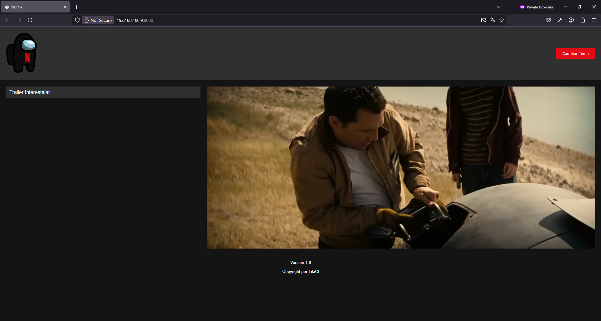
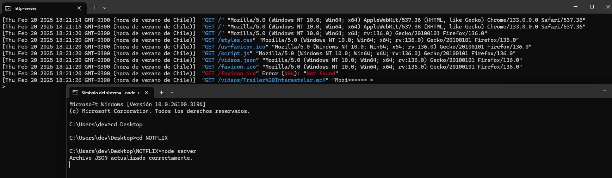

# Notflix - Proyecto de Pruebas

**Notflix** es un proyecto de pruebas estable que simula una plataforma de reproducción de videos. Este proyecto está diseñado para reproducir archivos de video en formato MP4. Es una aplicación web simple que permite a los usuarios ver una lista de videos disponibles y reproducirlos en un reproductor de video integrado.

## Características

- **Reproducción de videos**: Reproduce archivos de video en formato MP4.
- **Tema claro/oscuro**: Permite a los usuarios cambiar entre un tema claro y oscuro.
- **Lista de videos dinámica**: La lista de videos se carga dinámicamente desde un archivo JSON.
- **Actualización automática**: El archivo JSON que contiene la lista de videos se actualiza automáticamente cada 12 horas.

## Requisitos

- Node.js
- Navegador web moderno

## Instalación

1. Clona este repositorio en tu máquina local.
   
   git clone https://github.com/tu-usuario/notflix.git

2. Inicia el servidor de node.js para leer los videos dentro de la carpeta /videos
    
    node server

3. Inicia el servidor de la página web

    http-client

## Estructura del proyecto

index.html: Archivo HTML principal que define la estructura de la página.

styles.css: Archivo CSS que contiene los estilos de la aplicación.

script.js: Archivo JavaScript que maneja la lógica de la aplicación, como la carga de videos y el cambio de tema.

server.js: Archivo JavaScript que maneja la actualización automática del archivo JSON que contiene la lista de videos.

videos.json: Archivo JSON que contiene la lista de videos disponibles para reproducción.

## Uso

1. Cambiar tema: Haz clic en el botón "Cambiar Tema" en la esquina superior derecha para alternar entre el tema claro y oscuro.

2. Reproducir videos: Haz clic en cualquier video de la lista para reproducirlo en el reproductor de video.

3. Accede a la ip del http-server para tener la aplicación web en cualquiera de tus dispositivos conectados a la misma red.
